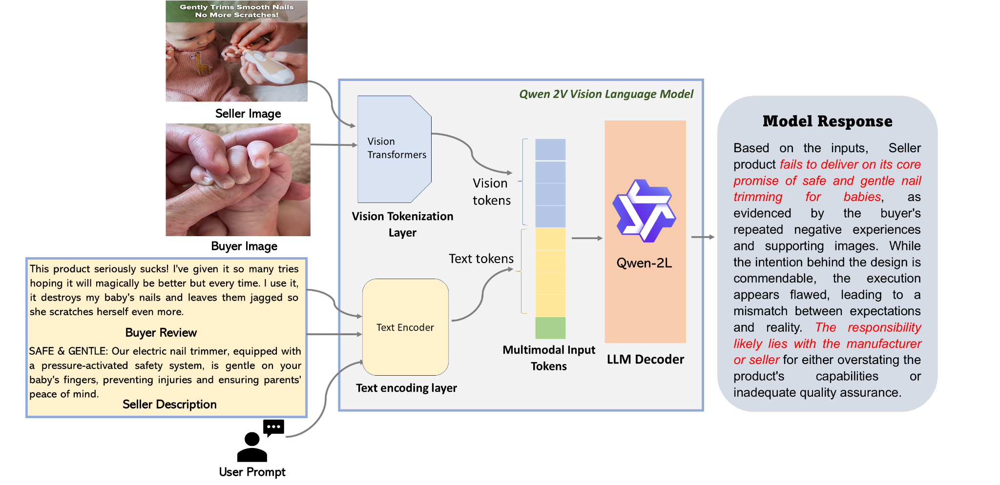

# ReViewQwen

**Explainable discrepancy detection for multimodal e-commerce reviews.**

ReViewQwen compares a seller's product description and image with a buyer's review and image. It assesses whether the buyer's evidence agrees with the advertised claims, indicates a discrepancy, or describes a preference outside the scope of those claims. The model also generates an explanation for human review.

[Paper — IEEE CBMI 2025](https://doi.org/10.1109/CBMI66578.2025.11339346) · [Released adapter](https://huggingface.co/domsoos/reviewqwen-large) · [Checkpoint and research notes](docs/CHECKPOINT.md)

**Sandeep Kalari · Mohan Krishna Sunkara · Dominik Soós · Vikas Ashok · Ravi Mukkamala**  
Old Dominion University

## The problem

A negative review does not necessarily mean a seller failed to deliver what was promised. A review can describe an actual mismatch, a fulfilled promise, or a personal expectation absent from the listing. ReViewQwen uses both text and images to examine that distinction.

| Class | Meaning |
| --- | --- |
| Agreement (`1`) | Buyer evidence agrees with the seller's claims |
| Discrepancy (`0`) | Buyer evidence indicates a mismatch with the claims |
| Out of scope (`-1`) | The concern is a preference or expectation outside the stated claims |

These are evidence-consistency categories. They do not establish fraud, deception, or legal responsibility.

## Architecture



ReViewQwen adapts **Qwen2-VL-7B-Instruct** with **LoRA** for buyer–seller comparison.

The released checkpoint is `domsoos/reviewqwen-large`, a LoRA adapter rather than a standalone 7B model. The demo loads the base model and attaches this adapter using PEFT.

## Try one example

### 1. Install

Use Python 3.10 or 3.11 in a fresh environment. A CUDA-capable NVIDIA GPU is recommended; the 7B base model requires substantial memory. The adapter's approximately 50 MB size does **not** represent the full download or runtime memory requirement. CPU execution is supported as an option but may be very slow and requires substantial RAM.

```bash
git clone https://github.com/Sandeep945-pixel/ReViewQwen.git
cd ReViewQwen
python -m venv .venv
```

Activate the environment on macOS/Linux:

```bash
source .venv/bin/activate
```

On Windows PowerShell:

```powershell
.\.venv\Scripts\Activate.ps1
```

Install [PyTorch for your hardware](https://pytorch.org/get-started/locally/), then the demo dependencies:

```bash
python -m pip install -r requirements-demo.txt
```

The dependency file specifies the demo API versions; it is not the original experiment environment. No paid model API key is required. The first inference run downloads the public base model and adapter from Hugging Face.

### 2. Check the fictional input

```bash
python infer.py --example demo/example.json --validate-only
```

This checks both text fields and opens both image files. It does not download weights or execute the model.

The bundled input is fictional and provided only to check the demo; it is not a paper evaluation example.

### 3. Run inference

```bash
python infer.py --example demo/example.json --output outputs/demo.json
```

Use `--device cuda` to require the first CUDA device, `--device cpu` for CPU execution, or the default `--device auto` for automatic placement. Run `python infer.py --help` for options.

The report contains the generated response, parsed class, model identifiers, adapter revision, and image resize setting. Only newly generated tokens are decoded. If a clear label cannot be parsed, the report records `unparsed_label` and a null label rather than guessing a class.

**Validation status:** input validation, label parsing, message construction, and mocked model-loading/generation checks have passed. Full inference with the downloaded checkpoint has not been verified for this release. Checkpoint availability alone does not establish demo accuracy or paper-result reproduction.

### 4. Use your own input

Create a JSON file using this structure:

```json
{
  "seller_description": "The claims made in the product listing.",
  "buyer_review": "The buyer's account of what they received.",
  "seller_image": "seller.jpg",
  "buyer_image": "buyer.jpg"
}
```

Image paths are relative to that JSON file. This demo requires two local images; it reports missing or unreadable files instead of substituting blank images. Use material you are authorized to process.

```bash
python infer.py --example path/to/example.json --output outputs/my-example.json
```

The default pre-resize is `424 × 424`, matching the checked-in training script. The base model's image processor then performs its own preprocessing. Use `--pixels 524` to select the size described in the paper; this does not recreate the paper's full experimental setup.

## Research evidence

The paper reports the following classification results in Table II:

| Model | Precision | Recall | F1 |
| --- | ---: | ---: | ---: |
| Phi-3.5 | 26.97% | 37.80% | 24.14% |
| PaliGemma2 | 32.82% | 37.74% | 30.03% |
| LLaMA-3.2 | 51.11% | 50.00% | 38.86% |
| Qwen2-VL | 51.15% | 47.11% | 41.28% |
| ReViewQwen | 80.43% | 79.03% | 78.86% |

These are **paper-reported results**, not measurements from the new demo. The paper additionally evaluates explanations with human annotators and an LLM judge. Generated explanations should be assessed separately from classification accuracy; a plausible explanation does not prove the model's internal reasoning is faithful.

The released adapter's configuration differs from the paper's stated training configuration. The existing data folders also require split-provenance review before benchmark reproduction. Details are in [checkpoint and research notes](docs/CHECKPOINT.md).

## Repository guide

| Path | Purpose |
| --- | --- |
| `infer.py` | New single-example demo loading the public adapter |
| `demo/` | Fictional input JSON and two schematic images |
| `requirements-demo.txt` | Dependencies for the new inference path |
| `qwen/` | Existing Qwen fine-tuning and dataset inference scripts |
| `prompting/` | Existing prompting and model-loading notebooks |
| `phi/`, `paligemma/`, `llama/` | Existing baseline code and/or saved predictions |
| `data/` | Existing image and metadata files, not just curation scripts |
| `accuracy.py` | Existing metric calculation script |
| `tests/test_infer.py` | Offline checks using synthetic inputs and mocked model responses |

The new demo is the recommended starting point for trying one example. Legacy scripts retain their original paths and experimental settings; they are not automatically configured by the demo installation.

## Limitations and appropriate use

Small or ambiguous image details, missing evidence, subjective reviews, and unfamiliar product categories can lead to incorrect classifications. The model may emphasize the wrong detail or generate unsupported explanations. Its outputs should support human inspection, not automatically determine refunds, penalize sellers or buyers, or establish wrongdoing.

The CLI processes inputs locally after downloading model assets; it does not call a hosted inference API. Output JSON retains model-generated analysis and can repeat input details. Keep sensitive inputs and outputs private. Code, dataset, and adapter licensing should be checked independently before reuse or redistribution; a comprehensive license declaration is not supplied in the current repository/model card.

## Citation

Sandeep Kalari, Mohan Krishna Sunkara, Dominik Soós, Vikas Ashok, and Ravi Mukkamala. **ReViewQwen: An Explainable Vision-Language Model for Discrepancy Detection in Multimodal E-Commerce Reviews.** IEEE CBMI, 2025. [DOI: 10.1109/CBMI66578.2025.11339346](https://doi.org/10.1109/CBMI66578.2025.11339346).

See [CITATION.cff](CITATION.cff) for machine-readable citation metadata. The paper links the [collaborator repository](https://github.com/domsoos/reviewqwen); this repository provides Sandeep Kalari's project presentation and demo entry point.
